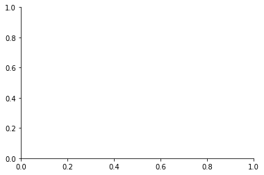

如何移动matplotlib 中 axis 坐标轴的位置.

## 设置不同名字和位置


```python
import matplotlib.pyplot as plt
import numpy as np
```

使用 `np.linspace` 定义 `x` ：范围是(-3,3);个数是50. 仿真一维数据组(`x` ,`y1`)表示曲线1. 仿真一维数据组(`x` ,`y2`)表示曲线2.


```python
x = np.linspace(-3, 3, 50)
y1 = 2*x + 1
y2 = x**2
```

使用`plt.figure`定义一个图像窗口. 

使用`plt.plot`画(`x` ,`y2`)曲线.   
使用`plt.plot`画(`x` ,`y1`)曲线，曲线的颜色属性(`color`)为红色; 曲线的宽度(`linewidth`) 为 1.0; 曲线的类型(linestyle)为虚线.   

使用`plt.xlim`设置`x`坐标轴范围: (-1, 2);    
使用`plt.ylim`设置`y`坐标轴范围: (-2, 3);   


```python
plt.figure()
plt.plot(x, y2)
plt.plot(x, y1, color='red', linewidth=1.0, linestyle='--')
plt.xlim((-1, 2))
plt.ylim((-2, 3))
```


    (-2, 3)


使用`np.linspace`定义范围以及个数：范围是(-1,2);个数是5. 

使用`plt.xticks`设置`x`轴刻度：范围是(-1,2);个数是5.   
使用`plt.yticks`设置`y`轴刻度以及名称: 刻度为[-2, -1.8, -1, 1.22, 3]; 对应刻度的名称为[‘really bad’,’bad’,’normal’,’good’, ‘really good’].


```python
new_ticks = np.linspace(-1, 2, 5)
plt.xticks(new_ticks)
plt.yticks([-2, -1.8, -1, 1.22, 3],['$really\ bad$', '$bad$', '$normal$', '$good$', '$really\ good$'])
```


    ([<matplotlib.axis.YTick at 0x109ab4128>,
      <matplotlib.axis.YTick at 0x109a3ea58>,
      <matplotlib.axis.YTick at 0x111fa9160>,
      <matplotlib.axis.YTick at 0x111f0e390>,
      <matplotlib.axis.YTick at 0x111f9a3c8>],
     <a list of 5 Text yticklabel objects>)


function | desc | 效果
--------|-------|-------
`plt.gca` | 获取当前坐标轴信息 | -
`.spines` | 设置边框 | 右侧边框 & 上边框
`.set_color` | 设置边框颜色 | 默认白色


```python
ax = plt.gca()
ax.spines['right'].set_color('none')
ax.spines['top'].set_color('none')
plt.show()
```





## 调整坐标轴

使用 `.xaxis.set_ticks_position`设置`x`坐标刻度数字或名称的位置：`bottom`.（所有位置：`top`，`bottom`，`both`，`default`，`none`）   
使用 `.spines` 设置边框：`x`轴；     
使用 `.set_position` 设置边框位置：`y=0` 的位置；（位置所有属性：`outward`，`axes`，`data`）  


```python
ax.xaxis.set_ticks_position('bottom')

ax.spines['bottom'].set_position(('data', 0))

plt.show()
```

使用`.yaxis.set_ticks_position`设置`y`坐标刻度数字或名称的位置：`left`.（所有位置：`left`，`right`，`both`，`default`，`none`）


```python
ax.yaxis.set_ticks_position('left')
```

使用`.spines`设置边框：`y`轴；使用`.set_position`设置边框位置：`x=0`的位置；（位置所有属性：`outward`，`axes`，`data`）   
使用`plt.show`显示图像.


```python
ax.spines['left'].set_position(('data',0))
plt.show()
```
