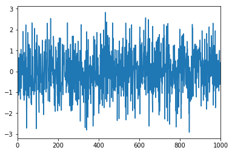
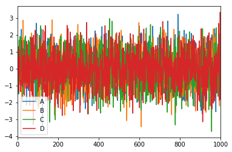
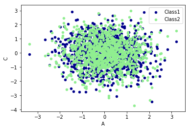

matplotlib 将数据可视化. 仅仅是用来 show 图片的, 即 plt.show()

<!-- more -->

```python
import pandas as pd
import numpy as np
import matplotlib.pyplot as plt
```

## 创建一个Series

这是一个线性的数据，我们随机生成1000个数据，`Series` 默认的 `index` 就是从0开始的整数

```python
# 随机生成1000个数据
data = pd.Series(np.random.randn(1000),index=np.arange(1000))
 
# pandas 数据可以直接观看其可视化形式
data.plot()

plt.show()
```



可以使用 `plt.plot(x=, y=)`，把`x`,`y`的数据作为参数存进去，但是`data`本来就是一个数据，所以我们可以直接`plot`

## Dataframe 可视化

我们生成一个 1000*4 的 `DataFrame`，并对他们累加

```python
data = pd.DataFrame(
    np.random.randn(1000,4),
    index=np.arange(1000),
    columns=list("ABCD")
    )
#data.cumsum()
print(data)
data.plot()
plt.show()
```

                A         B         C         D
    0    1.163604 -0.689103  1.958018  0.241444
    1    0.595765  0.816026  1.573164 -0.443003
    2   -0.101446  0.768321 -0.203069 -0.638841
    3   -0.439233 -0.161273  0.398774  1.309622
    4   -0.524647 -0.180073 -1.499978  0.628436
    5   -0.305683  0.668840  0.243668 -1.386839
    ..        ...       ...       ...       ...
    998 -0.243955 -0.190122 -0.299633  3.350200
    999 -0.055184  0.936187  0.146156  0.604271
    
    [1000 rows x 4 columns]



这个就是我们刚刚生成的4个`column`的数据，因为有4组数据，所以4组数据会分别`plot`出来。

plot 可以指定很多参数，具体参见[官方文档](http://pandas.pydata.org/pandas-docs/version/0.18.1/visualization.html)

除了plot，我经常会用到还有scatter，这个会显示散点图，首先说一下在 pandas 中有多少种方法

- bar
- hist
- box
- kde
- area
- scatter
- hexbin

主要说一下 `plot` 和 `scatter`. 因为 `scatter` 只有 `x`，`y` 两个属性，可以分别给 `x`, `y` 指定数据

```python
ax = data.plot.scatter(x='A',y='B',color='DarkBlue',label='Class1')
```

然后我们在可以再画一个在同一个`ax`上面，选择不一样的数据列，不同的 `color` 和 `label`


```python
# 将之下这个 data 画在上一个 ax 上面
data.plot.scatter(x='A',y='C',color='LightGreen',label='Class2',ax=ax)
plt.show()
```



两种呈现方式，一种是**线性的方式**，一种是**散点图**
