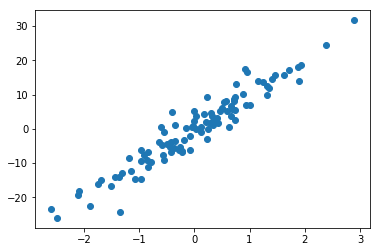
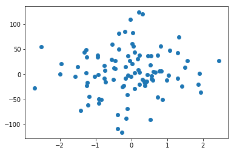

## 导入模块

导入 `datasets` 包，以 Linear Regression 为例


```python
from __future__ import print_function

from sklearn import datasets
from sklearn.linear_model import LinearRegression

import matplotlib.pyplot as plt
```

## 导入数据－训练模型

用 `datasets.load_boston()` 的形式加载数据，并给 `X` 和 `y` 赋值，这种形式在 Sklearn 中都是高度统一的


```python
loaded_data = datasets.load_boston()

data_X = loaded_data.data
data_y = loaded_data.target

print(data_X[:4, 0]) # == print(data_X[:4][0])
print(data_y[:4])
```

    [ 0.00632  0.02731  0.02729  0.03237]
    [ 24.   21.6  34.7  33.4]


定义模型

可以直接用默认值去建立 `model`，默认值也不错，也可以自己改变参数使模型更好。 然后用 `training data` 去训练模型。


```python
model = LinearRegression()
model.fit(data_X, data_y)
```


    LinearRegression(copy_X=True, fit_intercept=True, n_jobs=1, normalize=False)


再打印出预测值，这里用 `X` 的前 4 个来预测，同时打印真实值，作为对比，可以看到是有些误差的。


```python
print(model.predict(data_X[:4, :]))
print(data_y[:4])

"""
[ 30.00821269  25.0298606   30.5702317   28.60814055]
[ 24.   21.6  34.7  33.4]
"""
```

    [ 30.00821269  25.0298606   30.5702317   28.60814055]
    [ 24.   21.6  34.7  33.4]


    '\n[ 30.00821269  25.0298606   30.5702317   28.60814055]\n[ 24.   21.6  34.7  33.4]\n'


为了提高准确度，可以通过尝试不同的 `model`，不同的参数，不同的预处理等方法，入门的话可以直接用默认值。

## 创建虚拟数据－可视化

下面是创造数据的例子。

用函数来建立 100 个 `sample`，有一个 `feature`，和一个 `target`，这样比较方便可视化。


```python
X, y = datasets.make_regression(n_samples=100, n_features=1, n_targets=1, noise=3)
```

用 scatter 的形式来输出结果


```python
plt.scatter(X, y)
plt.show()
```





可以看到用函数生成的 `Linear Regression` 用的数据。

`noise` 越大的话，点就会越来越离散，例如 `noise` 由 10 变为 50.


```python
X, y = datasets.make_regression(n_samples=100, n_features=1, n_targets=1, noise=50)
plt.scatter(X, y)
plt.show()
```




